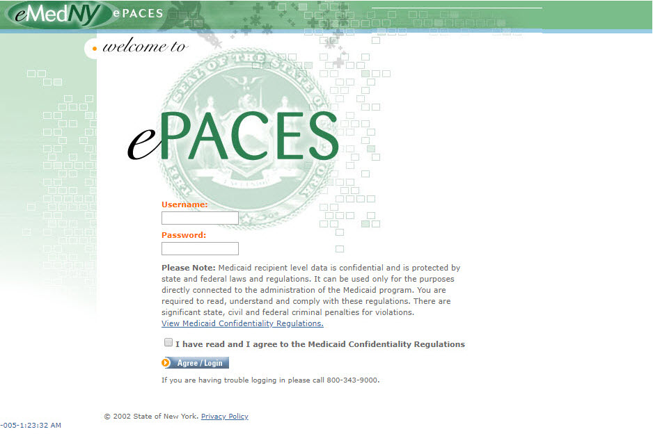
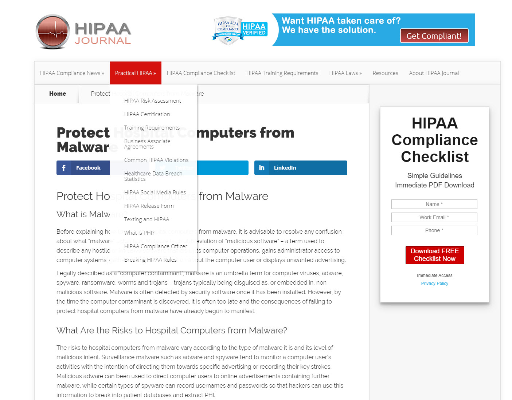

# Independent Study Final Week 12 Assignment Final Notes
+ By: Jane Yeh

## INTRODUCTION
The healthcare industry is ever evolving and heavily monitored by government regulations, technology and expectations. 

Operating a successful health system, or medical practice isn’t just about treating patients anymore. 

Security concerns, relationship building,  provider network, quality, performance, business partnerships, and sometimes even political commitment are all part of the equation in a smooth operation in today's world.

Looking ahead to 2020 and beyond, there are many hurdles to address that may well impact health plans, hospitals and patients…but today, I want to focus on mobile access to healthcare data.

##	WHAT IS HEALTH INSURANCE?

+ How does it work?
+ Why is it Important?

Many of us have benefited from health services one way or another in our lives, and I want to touch on insurance a little bit.

What IS health insurance, how it works, and why it’s important to us. 

The timeline shown above details some of the changes that have taken place. Many changes are still expected over the next several years. 

In present day, the law requires nearly all Americans to have health coverage referred to as the health care reform. The purpose is to ensure that health insurance is affordable and available to all Americans. At one point in time, there was a penalty assessed on your tax return for failure to obtain health insurance, however the Trump administration has changed the rules and eliminated the penalty on the federal level in 2019 though a handful of states still continue to assess their own penalties. These 6 states are New Jersey, DC, Massachusetts, Vermont, Rhode Island and Maryland. The prior tax penalty for not having health insurance in 2018 was $695 for adults and $347.50 for children or 2% of your yearly income, whichever amount is more. There are exceptions to the rule which makes you exempt from this, such as being a recipient of government funded programs, or if you are native American or simply just live outside of the U.S. 

In theory, the Affordable Care Act is still in effect, but there’s no longer a penalty to enforce it. 

Health insurance covers medical expenses for illnesses, injuries and conditions. Medical expenses can be high, and health insurance is a way to help alleviate how you are going to pay.

It is a safeguard to your wellness. Being a member of a health plan provides you with access to a network of doctors and hospitals, which have a negotiated service rate and a promise for quality care. The level of coverage and out of pocket expense varies dependent on plan and its important to remember insurance truly carries its’ weight. Sometimes it pays for your hospital stays, prescription drugs, doctor visits, or whether you will receive treatment (for a chronic illness or emergency accident). 

Health insurance works together with hospitals, providers and specialty groups to ensure you are protected.

UnitedHealth Group employs approximately 168,000 individuals in 21 countries, including Australia, Canada, China, India, Philippines, Ireland, Italy and the United Kingdom.

UnitedHealthcare covers approximately 45 million individuals worldwide.  In 2015, UnitedHealth Group ranked No. 1 on Fortune's "World's Most Admired Companies" list in the insurance and managed care section for the fifth year in a row. 

In a healthcare organization, such as Unitedhealthcare offers health care products and insurance services. It is the largest healthcare company in the world by revenue, with 2019 revenue of $242.2 billion.

While working as a senior provider advocate at UHC, I was responsible for a portfolio of over 700 providers (which translates to about 600,000 members) in tier 1 and tier 2 across Queens county, Nassau county and parts of Suffolk county. I serviced the relationship as the primary point of contact, identifying and resolving any issues that arise. I developed a competitive and balanced distribution of provider specialties and provider network.

My network distribution included physicians/hospitals/ancillaries –radiology, audiology, pulmonary testing services, clinical laboratory services, physical therapy, speech therapy, psychotherapy and occupational therapy/DME –durable medical equipment etc. 

As such, I initiated and executed contracts for qualified group practices.  This involved evaluating fee schedules and negotiating contract rates. I was responsible for enrollment, credentialing and re-certification of providers. And as part of recruiting efforts, I also conducted provider training, development and education on plan policies and procedures. 

Aside from the workload which frequently kept me in the field and away from my desk,  I was often jotting down notes on pen and paper since the only way for me to look up information was back at my office.

I looked forward to be able to access information from my computer and developed a habit to travel with stacks of literature, claims, codes, contracts as hard copy. A sample health insurance claim form is shown below:

Carrying around file folders containing contracts, claims, and credentials were difficult to maintain and run the risk of getting damaged or misplaced. I hoped for a better way to make the health system work better for everyone and to create a system that is connected and more affordable while being useful with mobile access.

Fortunately, advanced data and technologies, breakthrough solutions and consumer choice are redefining what can be achieved.

##	CURRENT DATABASES
To give you an idea of the programs I worked with at Unitedhealthcare. Is anyone familiar with these databases? Many are outdated, and independent of each other. They each require individual login credentials, and a have a unique approach in retrieving data.

+ CAQH Proview – Council for Affordable Quality Healthcare credentialing database

+ NPI Registry - National Provider Identifier Registry (search for providers in the NPPES (National Plan and Provider Enumeration System) The NPI number is a unique 10-digit identification number issued to covered health care providers by the CMS (Centers for Medicare and Medicaid Services). 

+ Facets – Integrated health care payer solution (claims processing, service monitoring)

+ ePaces – Medicaid status verifier

+ Phycon – Emergency Medical Billing/Coding/practice management

Unitedhealthcare utilized over 20 databases to retrieve data ranging from claims, fees, credentialing, location services, education, internal communication, and many more. There seemed to be an application for every item we needed to look up, most which did not speak to one another.

Manually logging in to each system, required a unique identifier which also required frequent pass code changes. 

So with more databases than you can count on both hands, many people started to print and keep a log on their desk. This in itself defeated the purpose of encryption. It also violates so many privacy and security issues. 

+ RACF  -Resource Access Control Facility (verification –ID, Password, rights, protected access)
+ NDB - Network Database Provides enhanced capability and efficiency for physician and health care professional information with releases focused on upgraded infrastructure, demographic maintenance and strategic contracting.
+ EDSS - Expanded Disability Status Scale
+ IDRS - Independent Dispute Resolution
+ COSMOS-claims processing system
+ UNET – claims processing system
+ ORS – Outcome results systems (track and report service requests)
+ iBAGG – Benefits administration
+ Webex – Cisco online video conferencing
+ Topsking – Inter-department communications platform
+ ISET – UHC Operations system
+ Orbit – dashboard reporting
+ DRG - Diagnosis Related Group (standardizes payment to hospitals and cost initiatives)
+ Rainbow –Home health care transportation console
+ Caremark Pharmacy Access – Prescription authorization
+ CRM – Marketing software
+ Footprints – workflow automation and change management for healthcare service

Even with our in house business health solution department -Optum –lock outs were a pain to lift and caused major downtime. 

Filtering each console, and manipulating multiple logins to collect and retrieve data here and there also posed difficulty for those on the field. Multi-system database is complicated and onboarding of a new employee by training multiple databases is confusing. Outdated systems did not talk to each other.

##	CHALLENGES
With such concerns….it begs one important question.
“Why isn’t all this information readily available on my smartphone?”

There are 3 groups of challenges that need to be addressed before UHC can make that information available:

+ Regulatory
+ Technological
+ People

## REGULATORY

In addition to data privacy laws that apply to all industries, healthcare is subject to additional laws like HIPAA and HITECH.
HIPAA’s Privacy Rule defines the use and disclosure of Protected Health Information or “PHI”. PHI is any information regarding the health status, provision of health care, or health care payment that can be linked to any individual.  

 
HIPAA is the Health Insurance Portability and Accountability Act and its purpose was to help people maintain health insurance. HIPAA is the acronym for the Health Insurance Portability and Accountability Act that was passed by Congress in 1996.  

HIPAA does the following:
Provides continued health coverage for American workers and their family in the event they switch workplace lose their job.
HIPPA helps reduce fraud and/or abuse, regulate industry standard measures for health information sharing.

Under the HIPAA minimum necessary standard, HIPAA-covered entities are required to make reasonable efforts to ensure that access to PHI is limited to the minimum necessary information to accomplish the intended purpose of a particular use, disclosure, or request.

Health Information Technology for Economic and Clinical Health Act or “HITECH” was passed in 2009 and it widened the protections available by increasing the legal liability.

The average penalty for an organization is in the millions, and it has been steadily increasing over time. A data breach can easily cost a company millions of dollars in fines. 

However, organizations are not the only ones who can be penalized.  HITECH also allows for fines and jail time for individuals who willfully violate HIPAA’s privacy rules, with a maximum fine of $250,000 and up to one year in prison.

One example of this would be when a surgeon, Huping Zhou of Los Angeles, was sentenced to jail for 4 months and received $2,000 in fines for sharing medical records of his superiors, and celebrities' PHI. 

Given these penalties, organizations are risk adverse when it comes to making data available.  The culture is more along the lines of HIPAA’s Minimum Necessary Standard …. Giving you the minimum data necessary to do your job.

## TECHNOLOGY

Operating under HIPAA, there is a very conscious effort to protect information.  Let’s take a look at some of the Technology challenges:

Lack of Interoperability between information systems – Healthcare information systems designed by different vendors generally do not talk to each other … and its difficult to export information out of them.  This is because there is very little incentive for the vendor to make it easy.  This helps lock-in their business while they use HIPAA and data protection as an excuse for keeping the data in a silo.

The next challenge is unsecure computers and servers.  HIPAA requires that data be protected on your computer.  In order to do that, you need to make sure that the computer used to view the data is also protected from things like:

Viruses, Malware, Spyware or any malicious software.

HIPAA also requires that the data be protected in transit.  The challenge here is Unsecure Networks.   The internet by default is not secure.  Emails are also not secure….and the public WIFI at Starbucks is definitely not secure.

## PEOPLE

Last but not least, we have the challenges related to “People”.  
You can have the most secure networks and computers, but the weakest link tends to be people.  

Examples are easy to guess passwords.  This is a list of the top 20 most popular passwords…do any of them look familiar?

Another problem is that there are still people who click on links from either phishing emails or fake web sites.

Carelessness is also a problem.  A lost laptop, phone or USB drive can easily contain data for millions of patients.

All of these problems are compounded by people’s natural resistance to change.  Change is not easy, especially if you want them to behave in a secure manner that often times are inconvenient.

## RECOMMENDATIONS
With so many challenges, what can a large healthcare organization like UnitedHealth do to start moving their data to a mobile platform?  

I’ll talk about some recommendations.

## REGULATORY STANDPOINT
From a Regulatory Standpoint,  In 2009, the U.S. passed the HITECH Act, which proposed the “Meaningful Use” of interoperable electronic health records throughout the U.S. healthcare delivery system as a national goal.

“Meaningful Use” was defined as the use of certified electronic health records technology in a meaningful manner (for example electronic prescribing) and ensuring that the technology provides for the electronic exchange of health information.  To encourage this, The Center for Medicare and Medicaid Services or “CMS” initially provided financial incentives for organizations who adopted software systems that were certified for Meaningful Use. 

Eventually, the incentives turned into penalties for late adopters.  The current goal is to promote interoperability among Electronic Health Record Systems (EHR) to facilitate health information exchange.  Although this “Meaningful Use” forces vendors to “talk” to each other, the actual implementation is left up to the vendors.

EHR-An electronic health record (EHR) is the digital version of a patient's medical records which are made available to authorized agents in real time. Aside from authorized medical staff, the electronic health records are only provided to you or your personal representative. 

Electronic prescribing (e-prescribing or e-Rx) is the electronic submission of prescription medications. E-prescribing reduces the risks associated to faulty prescipription fulfillment. 

Some specific interoperability standards were developed by Health Level Seven, a non profit standards development organization that focuses on healthcare.  Their standards include HL7 which defines a standard message format for data exchange between healthcare systems and its successor, Fast Healthcare Interoperability Resource or “FHIR” which takes a more modern,internet-based approach for connecting systems together so they can talk to each other.

For sending secure messages between systems over the internet,  the Direct message standard was specifically created to support health data exchange by allowing for encrypted email serviced by a specialized Health Internet Service Providers.

Securing the network can be readily accomplished by moving applications to a Cloud Service Provider.  In such a scenario, it is possible to transfer a lot of the network risks and responsibilities over to the Cloud Provider. 

Responsibilities such as:
+ Physical Security
+ Infrastructure Security
+ Network Security
+ Server Patching and updating

These become the Cloud Provider’s responsibility.

Unfortunately, UHC would still need to be responsible for user security and the security of our own applications.

Also, the use of a Virtual Private Network or “VPN” can also be used to create a secure connection between the user and the application over the public internet.

Even if the Network is secure, the PC or phone used to access the application and data also needs to be secure.  Some ways to secure a computer includes:

#1 - Using strong passwords.  Don’t use easily guessable passwords like ‘123456’

#2 – Encrypt the hard drive using a Trusted Platform Module or “TPM”.A “TPM” is a chip on your computer that is needed to unlock your hard drive.  In the event that your hard drive is stolen, the contents of your hard drive cannot be read if it has been removed from your PC.

#3 – Disable booting from CD or USB.  This helps prevent a hacker from unlocking your computer using their boot up password hacking tools.

#4 – Install anti-malware software and keep it updated.

#5 – Avoid using public WIFI hotspots.  They are not secure.
And last, but not least

#6 – Keep all the security patches up to date.

The “People” challenge is the most difficult to overcome.  You can have the securest computer over the securest network, but you have one user who creates a password like ‘123’ …

I don’t believe people do that to be difficult, rather, it’s the security mindset that is difficult.  If we can make it a little easier, then we would get better results.

Some recommendations:

+ Single Sign On.  There are too many systems with too many user ids and passwords.  A single sign on system will allow us to use a single user id and password for all the systems.
+ Strong, but reasonable Passwords.  No ‘123’, but also not make it 16 characters requiring an uppercase, lowercase, number and special character.
+ Multifactor Authentication.  In addition to a strong password, use a biometric device or DUO.
+ Install anti-malware that explains problems in plain English.
+ Hosted Applications.  If there is nothing installed and stored locally, there is no data to lose if the laptop is stolen.

+ And perhaps the most important step to securing people:
Education to instill a “Secure” mindset.  Examples like, don’t click on email links, don’t use simple passwords like ‘123’ and log out of applications when done.

## BENEFITS

Let’s talk about some of the direct benefits of moving data to mobile access…

With information at our fingertips, we are able to analyze and resolve claims. We can review covered benefits, and issue authorizations quickly.
Being able to pull up their account we can verify activity, and assure continued compliance.

To assist in provider claims concerning compliance, and possible fraud we review compliance issues, then address and identify root cause, train provider staff on correct procedures, and provide written report of findings to prevent further abuse right away. Having information on the go not only helps identify fraud very quickly, and address problems but it nip it in the bud.

In assisting contract negotiations, we are able to pull up the most commonly billed codes and provide estimated yearly profits based on those services alone on the spot. This assists in closing the deal so we can agree on our contract and avoid the prolonged back and forth.

In the past we were not able to do this, because we have to return to the office. Look it up, review our findings, and get back to them in a few days. Sometimes, contracts can take months to years to close, and sometimes fraudulent claims require the assistance from SIU (special investigative unit) to flag the account to prompt compliance.

Mobile access to data also expedites new provider enrollment. It allows us to see current account status, and review the provider’s credential (specialties, what group practices they are currently participating, the locations they operate, and whether there are concerning factors such as sanctions, or fraud.)

Adding a provider to their practice would be less hassle, more pleasant and which translates to higher profit margins and increased productivity.
 
## CONCLUSION

All things considered, Health IT has always been about getting the right information to the right people at the right time. 
But with HIPAA you have to also worry about the information getting to the wrong people as well.

Despite the growing interest for electronic access, this is just the early steps to improve access to healthcare information. High costs and heavily regulated requirements have prevented implementing these initiatives and limited more efficient use of resources but change is foreseeable.

Fortunately, advanced data and technologies, breakthrough solutions and consumer choice are redefining what can be achieved. With hospitals and facilities adopting to technology its only a matter of time the system approaches mobile access to healthcare data.

## RESOURCES
+ Production URL: 
<https://github.com/janenycxo/e15/blob/master/independent-study/README.md>
+ Code Validator https://validator.w3.org/ 
+ HTML & CSS Code Playground 
https://jsfiddle.net/

## REFERENCES
+ Health Information Privacy - https://www.hhs.gov/hipaa/index.html
+ HITECH Act - https://www.hhs.gov/hipaa/for-professionals/special-topics/hitech-act-enforcement-interim-final-rule/index.html 
+ HL7 International - https://www.hl7.org/
+ Centers for Medicaid and Medicare Services – https://www.cms.gov/ 
+ Affordable Care Act - https://www.healthcare.gov/glossary/affordable-care-act/
+ Unitedhealthcare - https://www.uhc.com/
+ Optum Health Services - https://www.unitedhealthgroup.com/businesses/optum.html 
+ The FBI Federal Bureau of Investigation - https://archives.fbi.gov/archives/losangeles/press-releases/2010/la010810a.htm
+ Big Commerce- https://www.bigcommerce.com/blog/data-security/
+ Cloud Computing - https://medium.com/mycloudseries/how-to-start-using-cloud-computing-as-a-startup-77055c60f74f
+ HIPAA Journal, Protect Hospital Computers from Malware - https://www.hipaajournal.com/protect-hospital-computers-from-malware/
+ Tech Radar - https://www.techradar.com/news/mobile-computing/laptops/10-ways-to-secure-a-laptop-1148348
+ HIPAA Journal - https://www.hipaajournal.com/
+ World's Worst (Most Common) Passwords https://securityscorecard.com/blog/worlds-worst-passwords 
+ Idaptive Single Sign-on - https://www.idaptive.com/product/single-sign-on/?utm_source=google&utm_medium=cpc&utm_campaign=r2i-idaptive-product-sso-broad&utm_content=1x1&_bt=347479782957&_bk=single%20sign%20on&_bm=p&_bn=g&_bg=68920238534&gclid=EAIaIQobChMIy4eU4vGH6QIVF8DICh0ZNw17EAAYASAAEgLiIPD_BwE 